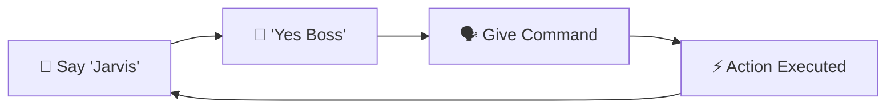
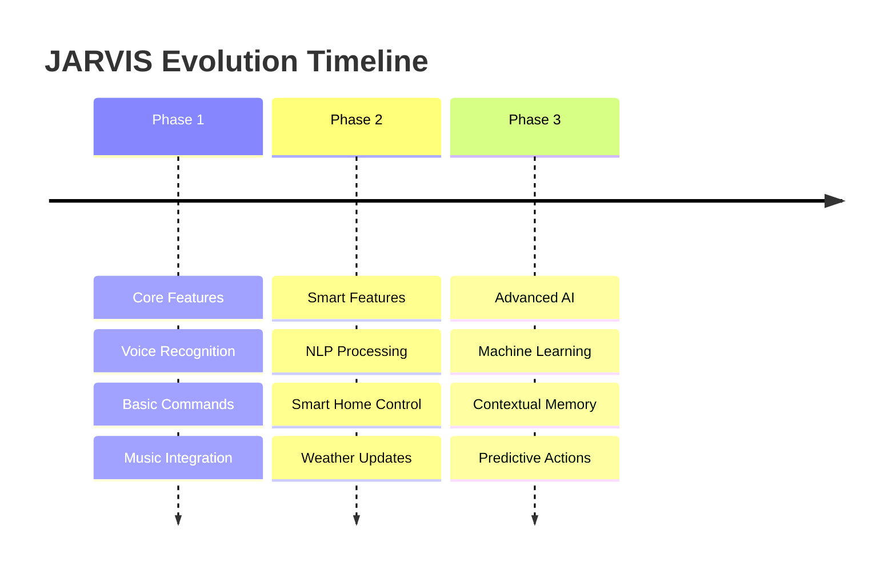

<div align="center">

# 🤖 JARVIS - AI Voice Assistant

[](https://python.org)
[](https://github.com/Uberi/speech_recognition)
[](LICENSE)
[](https://github.com/NayeemHossenJim/Jarvis)

### *"Just A Rather Very Intelligent System"*

**A sophisticated Python-based voice-activated personal assistant inspired by Iron Man's JARVIS**

*Transform your computer into an intelligent companion that responds to your voice commands*

</div>

---

## ✨ Features

<table>
<tr>
<td width="50%">

### 🎤 **Voice Recognition**
Advanced speech-to-text processing using Google's Speech Recognition API

### 🔊 **Text-to-Speech** 
Natural voice responses using pyttsx3 engine

### 🌐 **Web Automation**
Voice-controlled web browsing for popular sites

</td>
<td width="50%">

### 🎵 **Music Integration**
Voice-controlled music playback with custom library

### 📰 **News Updates**
Real-time news fetching using NewsAPI

### 👌 **Hands-free Operation**
Complete voice-controlled interface

</td>
</tr>
</table>

## 🛠️ Tech Stack

<div align="center">

| Technology | Purpose | Badge |
|------------|---------|-------|
| **Python 3.x** | Core Language |  |
| **SpeechRecognition** | Voice Input |  |
| **pyttsx3** | Text-to-Speech |  |
| **requests** | HTTP Requests |  |
| **webbrowser** | Web Automation |  |
| **NewsAPI** | News Integration |  |

</div>

## � Installation

<details>
<summary><b>🔽 Click to expand installation steps</b></summary>

### Prerequisites
Make sure you have Python 3.x installed on your system.

### Install Dependencies
```bash
# Install required packages
pip install speechrecognition
pip install pyttsx3
pip install requests
pip install pyaudio
```

### For Windows Users
If you encounter issues with `pyaudio`, try:
```bash
pip install pipwin
pipwin install pyaudio
```

</details>

## 🎯 Voice Commands

<div align="center">

| Command | Action | Example |
|---------|--------|---------|
| 🌐 `"Open YouTube"` | Opens YouTube in browser | *Say: "Open YouTube"* |
| 🔍 `"Open Google"` | Opens Google search | *Say: "Open Google"* |
| 📘 `"Open Facebook"` | Opens Facebook | *Say: "Open Facebook"* |
| 🎮 `"Open Unreal Engine Documentation"` | Opens UE docs | *Say: "Open Unreal Engine Documentation"* |
| 🎵 `"Play [song name]"` | Plays specified song | *Say: "Play Skyfall"* |
| 📰 `"News"` | Fetches latest headlines | *Say: "News"* |

</div>

> **💡 Tip:** Always say "Jarvis" first to activate the assistant, then give your command after hearing "Yes Boss"

## 🚀 Quick Start

<div align="center">

### 🎬 **Demo Workflow**



</div>

### **Step-by-Step Setup:**

```bash
# 1️⃣ Clone the repository
git clone https://github.com/NayeemHossenJim/Jarvis.git
cd Jarvis

# 2️⃣ Install dependencies
pip install -r requirements.txt

# 3️⃣ Get your NewsAPI key
# Visit: https://newsapi.org/register

# 4️⃣ Update API key in main.py
# Replace: News_API_Key = "your_api_key_here"

# 5️⃣ Run JARVIS
python main.py
```

### **🎙️ Usage:**
1. 🗣️ Say **"Jarvis"** to wake up the assistant
2. 👂 Wait for **"Yes Boss"** response  
3. 🎯 Give your voice command
4. ✨ Watch the magic happen!

## 📁 Project Architecture

<div align="center">

```
🏗️ Jarvis/
┣ 📜 main.py              # 🧠 Core application logic & voice processing
┣ 📜 Musiclibrary.py      # 🎵 Music database with song mappings  
┣ 📜 README.md            # 📖 Project documentation (you're here!)
┗ 📂 __pycache__/         # 🗃️ Python bytecode cache
```

</div>

### **🔧 Module Breakdown:**

| File | Responsibility | Key Functions |
|------|---------------|---------------|
| `main.py` | Voice recognition, command processing | `processcommand()`, `speak()` |
| `Musiclibrary.py` | Music database management | Song URL mappings |

## 🎵 Music Library

<div align="center">

### **🎼 Available Tracks**

| 🎤 Artist | 🎵 Song | 🔗 Platform |
|----------|---------|-------------|
| **Adele** | Skyfall | 🎬 YouTube |
| **Various** | Begging | 🎬 YouTube |
| **Various** | Slaver | 🎬 YouTube |
| **Various** | Run | 🎬 YouTube |

> 💡 **Add More Songs:** Edit `Musiclibrary.py` to expand your music collection!

</div>

## 🏆 Technical Skills Showcase

<div align="center">

<table>
<tr>
<td align="center" width="33%">

### 🔗 **API Integration**
- NewsAPI implementation
- Real-time data fetching
- Error handling & responses

</td>
<td align="center" width="33%">

### 🎤 **Speech Processing**
- Voice recognition systems
- Text-to-speech synthesis  
- Audio signal processing

</td>
<td align="center" width="33%">

### ⚡ **Real-time Systems**
- Continuous listening loops
- Asynchronous processing
- Multi-threading concepts

</td>
</tr>
<tr>
<td align="center">

### 🧩 **Modular Design**
- Clean code architecture
- Separated concerns
- Reusable components

</td>
<td align="center">

### 🛡️ **Error Handling**
- Exception management
- Graceful degradation
- Robust fault tolerance

</td>
<td align="center">

### 🌐 **Web Automation**
- Browser control
- URL manipulation
- Cross-platform compatibility

</td>
</tr>
</table>

</div>

## 🌟 Future Roadmap

<div align="center">



### **🚀 Upcoming Features:**

| Priority | Feature | Description |
|----------|---------|-------------|
| 🔥 **High** | Weather Updates | Real-time weather information |
| 🔥 **High** | Calendar Integration | Schedule management |
| 🔥 **High** | Email Management | Voice-controlled email |
| 🌟 **Medium** | Smart Home Control | IoT device integration |
| 🌟 **Medium** | Natural Language Processing | Better command understanding |
| 💡 **Future** | Machine Learning | Personalized responses |

</div>

---

<div align="center">

## �‍💻 About the Developer


### **Nayeem Hossen Jim**
*Software Developer & AI Enthusiast*

[](https://github.com/NayeemHossenJim)
[](https://www.linkedin.com/in/nayeem-hossen-jim)
[](mailto:nayeemhossenjim@gmail.com)

---

### 🎯 **Project Impact**

<table>
<tr>
<td align="center">
<h3>💻</h3>
<h4>Clean Code</h4>
<p>Well-structured & documented</p>
</td>
<td align="center">
<h3>🚀</h3>
<h4>Scalable Design</h4>
<p>Modular architecture</p>
</td>
<td align="center">
<h3>🔧</h3>
<h4>Practical Application</h4>
<p>Real-world problem solving</p>
</td>
<td align="center">
<h3>🎨</h3>
<h4>User Experience</h4>
<p>Intuitive voice interface</p>
</td>
</tr>
</table>

---

### ⭐ **Star this repository if you found it helpful!**

*Built with ❤️ by Nayeem Hossen Jim*

**© 2025 JARVIS Voice Assistant. This project demonstrates advanced Python programming skills and AI integration capabilities.**

</div>
 
